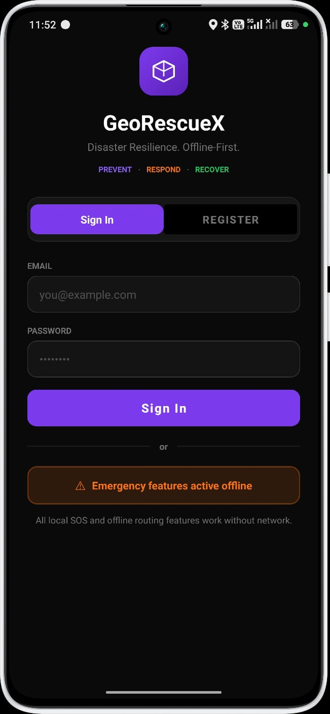
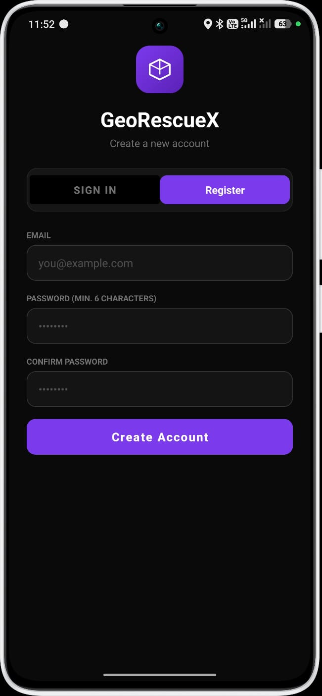
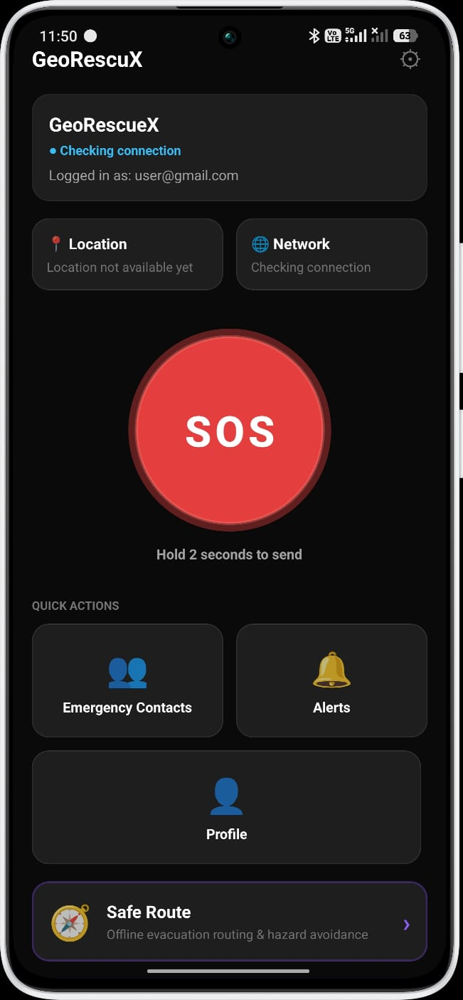
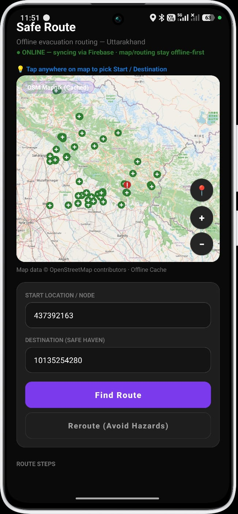
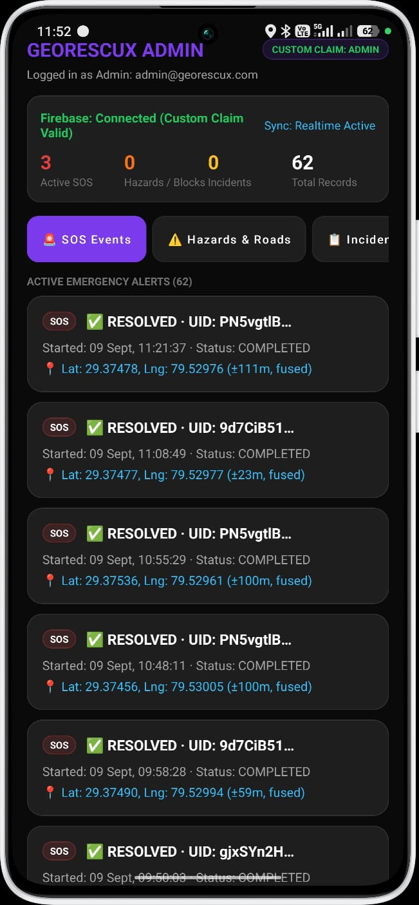

# GeoRescueX

**Disaster Resilience. Offline-First.**

GeoRescueX is an offline-first emergency response and disaster-resilience Android application, built for Smart India Hackathon 2026 (Problem Statement: **SIH26206** — Student Innovation, Disaster Management).

> The system that works even when everything else stops working.

The application is built around a three-phase lifecycle:

**PREVENT** · **RESPOND** · **RECOVER**

The application is built around a three-phase lifecycle:

The map/routing layer is fully local (OpenStreetMap-derived graphs; Firebase is never used for maps or routing).

| Region | RegionId | Status |
|---|---|---|
| Connaught Place, New Delhi (demo) | `sample-region` | bundled since Stage 7B-1 |
| **Uttarakhand (full state + border buffer)** | `uttarakhand` | **bundled since Stage 7B-4** — 117,972 nodes / 138,164 edges / 60,272 km of real OSM roads, 64 real safe havens |

The Uttarakhand dataset, its processing pipeline, verification audit, validation results, and regeneration instructions are documented in **[docs/UTTARAKHAND_REGION.md](docs/UTTARAKHAND_REGION.md)** and **[tools/uttarakhand/README.md](tools/uttarakhand/README.md)**.

Region selection is persisted per device (`MapRegionSelectionStore`); a GPS fix inside a bundled region switches to it automatically (`MapRegionCatalog.regionForLocation`). The sample region remains functional without modification.

## Overview

During disasters such as floods, earthquakes, landslides, and other emergencies, conventional navigation and cloud-dependent emergency systems may become unreliable because of:

* Internet or mobile network failure
* Damaged or blocked roads
* Rapidly changing hazard conditions
* Limited access to updated information
* Difficulty identifying feasible safe locations
* Limited smartphone availability in remote communities

GeoRescuX addresses this with an offline-first architecture where critical emergency and routing functionality remains local, while Firebase is used for synchronization once connectivity returns.

## Core workflow

SOS -> GPS location -> connectivity checks -> local/updated data -> hazard and road analysis -> local routing engine -> safe route -> safe haven / emergency destination -> synchronization when connectivity returns.

## Key features

### 1. Emergency SOS

The SOS flow is designed to operate even when network connectivity is poor or absent. It supports local persistence of emergency information, GPS-based location association, and deferred synchronization.

### 2. GPS and location intelligence

The app uses device GPS to track the user, capture SOS locations, and drive routing decisions. GPS is distinct from internet connectivity and should continue to function even when the network is unavailable.

### 3. OpenStreetMap-based mapping

GeoRescuX uses OpenStreetMap-derived geographic data for roads, user location, hazards, blocked roads, emergency resources, and safe-route visualization.

### 4. Offline-first routing

Rather than selecting the shortest path blindly, the routing engine evaluates hazards, blocked roads, and region-specific conditions to determine a safe and feasible route. Offline maps and route graphs remain available locally.

### 5. Regional route graphs

GeoRescuX uses region-scoped routing graphs rather than a single global graph. This improves data organization, storage discipline, and regional scalability.

### 6. Firebase sync and WorkManager

Firebase acts as a synchronization layer, not the only source of truth for immediate response. Pending local changes are retried using WorkManager when connectivity returns.

### 7. Admin-aware security model

Administrative access is enforced with Firebase custom claims and trusted backend infrastructure rather than client-side flags.

### 8. BLE emergency mesh (raw GATT subsystem & multi-hop relay)

A dedicated raw-BLE subsystem (`data/ble` + `domain/ble`, see **[docs/BLE_SUBSYSTEM.md](docs/BLE_SUBSYSTEM.md)**) provides a reliable, phone-to-phone emergency transport:
- **Foreground Service Lifecycle**: Managed by `GeoRescueBleForegroundService` with an ongoing status notification, running even when the app is backgrounded or the screen is locked.
- **Hardware Recovery**: `BluetoothStateReceiver` detects adapter on/off toggling and automatically recovers advertising and scanning.
- **Scan Cycling & Throttling Defense**: Duty cycle (30s scanning / 10s pause) keeps radios responsive while preventing Android background scan throttling.
- **Symmetric GATT Roles**: Every node simultaneously acts as GATT server (advertising, receiving on RX, notifying on TX) and GATT client (scanning, connecting, writing to peer RX, receiving TX notifications).
- **Multi-Hop Relay**: Structured `GeoRescueBlePacket`s with unique IDs, durable deduplication (`GeoRescueBleRepository`), and hop-based TTL decrement (default 5 hops) ensure store-and-forward routing (Phone A → Phone B → Phone C → Phone D) without endless loops.
- **Seamless Cloud Ingestion**: An internet-capable node that receives a relayed SOS persists it to local storage and immediately triggers `SyncRetryCoordinator` to push the alert to Firebase.
- **Diagnostics & Safety**: Single-tag logging (`GeoRescueX-BLE`), `BleDiagnosticsActivity` HUD, and isolated failure containment ensure BLE issues never affect SOS activation or device stability.

## Architecture

GeoRescuX follows a layered model separating presentation, domain logic, and data access:

Presentation -> Map UI
Domain -> Routing engine, hazard logic, SOS flow
Data -> Local storage, regional graphs, Firebase sync

This keeps emergency functionality resilient even when the network is unavailable.

## Design principles

1. Offline first
2. Local reliability
3. Safety over distance
4. Secure by design
5. Regional scalability
6. Graceful failure
7. Separation of concerns

## Technology stack

Android: Kotlin, Android SDK, Jetpack, WorkManager, location services
Mapping: OpenStreetMap, local map data, offline routing graphs
Backend: Firebase Authentication, Realtime Database, custom claims, security rules

## Project status

The current implementation is a prototype under active development. The core offline routing and map infrastructure are in place, with the Uttarakhand region and validation tooling documented in the regional docs.

## Building

Android Studio (AGP 8.13 / Kotlin 2.2), `minSdk 24`.

Unit tests: `./gradlew :app:testDebugUnitTest`

## Why GeoRescuX?

The central question is simple: what happens when a disaster occurs and the infrastructure around people fails?

GeoRescuX is designed to provide continuity of emergency operations even during weak or absent connectivity by combining local data, offline maps, GPS, safe routing, and deferred cloud sync.

## Important limitations

Offline capability is not equivalent to storing the entire world on-device. The required regional map data, routing graph, and hazard information must already be present locally. Real-world deployment still requires trained responders, operational validation, and appropriate governance.

---

## App Preview

| Login | Register | Dashboard |
|---|---|---|
|  |  |  |

| Safe Route (Uttarakhand) | Admin Panel |
|---|---|
|  |  |

---

## Core Features

### 🔐 Authentication
- Firebase Authentication-based Sign In / Register flow.
- User data and emergency records are scoped to the authenticated account, so one user's
  data never mixes with another's.
- **Emergency features remain active offline** even after login — the app does not gate
  core SOS/routing functionality behind a live connection.

### 🆘 SOS / Emergency Mode
- Dashboard → **Hold SOS (2 seconds)** → Countdown → Emergency ACTIVE.
- A deliberate hold-to-activate pattern prevents accidental triggers.
- A unique emergency ID is generated and stored **locally first** — activation does not
  wait on or depend on internet connectivity.
- GPS location is attached in the background once available; failure to acquire location
  does not cancel or delay the SOS flow.
- Quick Actions from the dashboard: **Emergency Contacts**, **Alerts**, **Profile**, and
  **Safe Route**.

### 🗺️ Safe Route — Offline Evacuation Routing (Uttarakhand)
- Offline-first navigation and evacuation routing, currently scoped to the **Uttarakhand**
  region as the first real regional dataset.
- Uses a cached OSM Mapnik map layer, so the map itself renders without a live connection.
- Tap-to-select **Start Location / Node** and **Destination (Safe Haven)** directly on the map.
- **Find Route** calculates a path using the local A* routing engine over the regional graph.
- **Reroute (Avoid Hazards)** recalculates around known blocked/hazardous road segments.
- Displays live sync status (e.g. "ONLINE — syncing via Firebase") while making clear that
  map rendering and routing themselves stay offline-first regardless of connection state.

### 🛠️ Admin Panel
- Custom-claim-gated administrator view (`CUSTOM CLAIM: ADMIN`) — administrative access is
  enforced via Firebase Custom Claims, not client-side flags.
- Live dashboard showing:
  - Active SOS count
  - Hazards / Road-block incident count
  - Total records synced
  - Realtime sync status
- Tabs for **SOS Events**, **Hazards & Roads**, and **Incidents**.
- Per-alert detail: user UID, activation timestamp, resolution status, and GPS coordinates
  with reported accuracy (e.g. `±23m, fused`).

---

## Architecture

GeoRescueX follows an **offline-first** design principle throughout:

```
Application → Local storage → Feature works
                    |
        (when network available)
                    v
        Synchronize local data → Firebase
```

Rather than:

```
Internet → Application → Feature
```

Key architectural components:

- **UI → ViewModel → Repository → Data/Domain** (MVVM, repository pattern)
- **Room / SQLite** for local persistence (SOS records, contacts, routing graph, hazard data)
- **Region-scoped routing graphs** (`route_graph_{regionId}`) — routing data is organized per
  region (e.g. Uttarakhand) rather than one monolithic nationwide graph, so new regions can be
  added independently
- **A\*** pathfinding engine operating on locally stored road-network graphs, with support for
  blocked-edge and hazard-cost penalties
- **Firebase** (Auth + Firestore) used strictly for authentication and cloud synchronization —
  never for map rendering or route calculation
- **WorkManager** for durable, retry-safe background synchronization when connectivity returns

---

## Tech Stack

- **Client:** Kotlin, Android SDK
- **Local storage:** Room (SQLite)
- **Maps:** OpenStreetMap (OSM Mapnik tiles, cached for offline use)
- **Routing:** Custom A* implementation over region-scoped graphs
- **Cloud:** Firebase Authentication, Cloud Firestore, Firebase Custom Claims (admin access)
- **Background sync:** WorkManager

---

## Project Status

This is an active hackathon prototype. Honest current status:

**Working:**
- Authentication and user-scoped data
- SOS activation with local-first persistence and background GPS
- Offline Safe Route calculation and rerouting for the Uttarakhand region
- Admin dashboard with real-time SOS/hazard monitoring
- Firebase sync with durable retry via WorkManager

**Not yet implemented:**
- Phone-to-phone peer relay (BLE / Nearby Connections) for zero-network SOS forwarding
- India-wide (multi-region) routing coverage
- Verified shelter / hospital / police / fire-station datasets
- India 112 emergency service integration

---

## Team

Built for Smart India Hackathon 2026 — Problem Statement **SIH26206** (Disaster Management,
Software Track) by **Sanidhya, Karan, Rudraksh, and Shobhit**.

---

## Getting Started

> Update this section to match your actual project structure/build steps.

1. Clone the repository.
2. Open in Android Studio.
3. Add your own `google-services.json` (Firebase project config) under `app/`.
4. Build and run on a physical Android device (recommended over emulator for GPS/offline
   map testing).

---

## License

Add a license of your choice (e.g. MIT) here.
