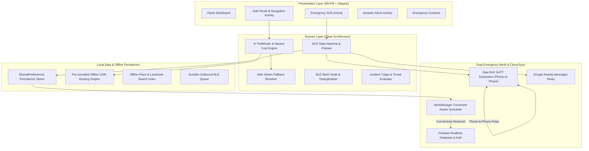

# GeoRescuX

<div align="center">


**Smart India Hackathon 2026 — Build For India 2.0**

### *Offline-First. Safety-Aware. Rescue-Focused.*

> *"When connectivity fails, the rescue system shouldn't."*

---

</div>

## Executive Summary

During natural disasters—such as Himalayan flash floods, landslides, cloudbursts, and earthquakes—conventional telecommunication infrastructure often collapses. Cellular towers go dark, power grids fail, and GPS routing apps that depend on live internet servers become completely inoperable.

**GeoRescuX** is an offline-first disaster response and emergency routing platform engineered specifically for low-to-zero connectivity environments. Critical life-safety actions—initiating SOS, computing hazard-avoiding evacuation routes, identifying safe havens, and broadcasting emergency packets across nearby phones—operate **100% locally on-device**. When cellular connectivity or Wi-Fi is restored, background workers automatically synchronize emergency data to emergency command centers without requiring user intervention.

---

## Architectural Highlights



---

## Key Features

### 1. Zero-Network Emergency SOS
* **State Machine Driven:** Robust lifecycle management (`IDLE` &rarr; `ACTIVATING` &rarr; `ACTIVE` &rarr; `RESOLVED` / `CANCELLED`).
* **Local Persistence First:** Emergency events are written immediately to local flash storage before any network or mesh transmissions are attempted.
* **Continuous GPS Breadcrumbs:** Retains accurate location logs with timestamped accuracy coordinates even when offline.

### 2. Hazard-Aware Offline Navigation
* **Local A* Routing:** Runs entirely on-device against OpenStreetMap graph topology; never queries cloud routing APIs.
* **Dynamic Hazard Cost Model:** Dynamically weights route segments based on active landslide, flood, and road blockage reports.
* **Safe Haven Fallback:** Automatically calculates the nearest viable shelter, hospital, police post, or relief camp if the intended destination is cut off by hazards.

### 3. Dedicated Raw BLE Emergency Mesh Subsystem
* **Custom GATT Profile:** Primary Service (`f5a6bd01-2c3e-4d5a-9b7f-1e3d5c7a9b01`), write-only RX characteristic, and notify-enabled TX characteristic.
* **Privacy-Preserving Discovery:** Advertises solely via Service UUID with no personal identifiers or device names in BLE broadcast packets.
* **Multi-Hop Store-and-Forward:** Packets contain a 5-hop Time-to-Live (`TTL`), cryptographically unique `packetId` for deduplication, and automatic forward queuing upon discovering peer devices.
* **Non-Blocking Guarantee:** BLE radio status or neighbor unavailability never delays or inhibits the primary SOS activation.

### 4. WorkManager-Backed Durable Cloud Sync
* **Process-Death Resilient:** Failed cloud syncs are queued via `SyncStateStore` and executed by Android `WorkManager` with network constraint triggers.
* **Survives Device Reboots:** If the phone is powered off or rebooted in airplane mode, pending sync markers trigger automatic upload upon the first network handshake—even if the app remains closed.
* **Idempotent Coalescing:** The `SyncRetryCoordinator` serializes sync jobs with `tryLock` semantics, eliminating redundant uploads and duplicate notifications.

### 5. Verified Regional OSM Datasets (Uttarakhand)
* **Real Production-Scale Region:** Pre-bundled with 117,972 nodes, 138,164 road edges, and 60,272 km of verified road ways across Uttarakhand and its border corridors.
* **Cross-Border Buffer Extents:** Bounding box deliberately encompasses border corridors (28.7–31.5°N, 77.5–81.1°E) across Himachal Pradesh, Haryana, and Uttar Pradesh to prevent route truncation at state lines.
* **Deterministic Offline Place Search:** Over 19,000 named villages, hamlets, towns, and emergency facilities indexed for instant offline search and node snapping.

### 6. Role-Based Dispatch & Security
* **Firebase Custom Claims:** Server-verified administrative role enforcement (`admin: true`) preventing client-side spoofing.
* **Administrative Incident Management:** Command center tooling for hazard verification, relief dispatch, and status broadcasting.

---

## Offline Region Catalog

| Region | Region ID | Nodes / Edges | Status | Details |
|---|---|---|---|---|
| **Connaught Place, New Delhi** | `sample-region` | Compact Test Grid | Bundled | Lightweight testbed for rapid local validation |
| **Uttarakhand (State + Buffer)** | `uttarakhand` | **117,972 / 138,164** | **Bundled** | Full state topography, 64 verified safe havens, 19k+ places |
| **Himachal Pradesh** | `himachal_pradesh` | Pipeline ready | Prepared | Manifest and boundary metadata generated |
| **Haryana** | `haryana` | Pipeline ready | Prepared | Manifest and boundary metadata generated |
| **Uttar Pradesh** | `uttar_pradesh` | Pipeline ready | Prepared | Manifest and boundary metadata generated |

*Detailed regional conversion pipelines, provenance reports, and validation audits are documented in [docs/UTTARAKHAND_REGION.md](docs/UTTARAKHAND_REGION.md).*

---

## Dual Mesh Subsystem Architecture

GeoRescuX deploys a layered, defense-in-depth communication strategy:

```
+-------------------------------------------------------------------------+
|                           EMERGENCY INCIDENT                            |
+-------------------------------------------------------------------------+
                                    |
                                    v
             +---------------------------------------------+
             |    Local Persistence (Flash SharedPreferences) |
             +---------------------------------------------+
               |                           |             |
               v                           v             v
    +--------------------+       +--------------------+  |
    | Raw BLE GATT Mesh  |       | Google Nearby Relay|  |
    | (Ad-hoc phone-to-  |       | (High-bandwidth    |  |
    |  phone emergency)  |       |  local discovery)  |  |
    +--------------------+       +--------------------+  |
               |                           |             |
               +-------------+-------------+             |
                             |                           |
                             v                           v
             +-------------------------------+   +-------------------+
             | First Peer with Active Uplink |   | WorkManager       |
             +-------------------------------+   | (When self-online)|
                             \                   /
                              \                 /
                               v               v
                +---------------------------------------------+
                |    Firebase Realtime Database Command Center|
                +---------------------------------------------+
```

*For in-depth packet framing specs, GATT characteristics, and power trade-offs, refer to [docs/BLE_SUBSYSTEM.md](docs/BLE_SUBSYSTEM.md).*

---

## Repository Structure

```
SIH2026-BuildForIndia_2.0/
├── .github/
│   └── workflows/
│       └── android-ci.yml        # Automated CI: unit tests & debug APK assembly
├── app/
│   ├── src/
│   │   ├── main/
│   │   │   ├── assets/
│   │   │   │   ├── maps/         # Bundled offline place indices & SQLite tiles
│   │   │   │   └── route_graph_* # Pre-compiled regional road network graphs
│   │   │   ├── java/com/example/georescux/
│   │   │   │   ├── core/         # Cross-cutting validators & utilities
│   │   │   │   ├── data/         # Repositories, BLE GATT engine, Firebase data sources
│   │   │   │   ├── domain/       # A* routing, SOS state machine, triage policies
│   │   │   │   ├── ui/           # Activities, ViewModels, and UI components
│   │   │   │   └── work/         # WorkManager background sync workers
│   │   │   └── res/              # Layouts, themes, drawables, and resource files
│   │   └── test/                 # 100+ JVM unit tests for all domain and data logic
│   └── build.gradle.kts          # App-level build configuration
├── docs/
│   ├── BLE_SUBSYSTEM.md          # Complete BLE GATT specification & testing protocol
│   ├── STAGE8_SYNC_RETRY_DESIGN.md# WorkManager durable sync architecture
│   └── UTTARAKHAND_REGION.md     # Regional dataset verification & audit trail
├── georescux-admin-provision/
│   ├── makeAdmin.js              # Node.js script for assigning Firebase custom claims
│   └── package.json
├── tools/
│   ├── uttarakhand/              # Zero-dependency Java OSM graph extraction tool
│   ├── sample-region/            # Sample region graph compiler
│   └── convert_to_map.ps1        # PowerShell automation for Osmosis map conversion
├── local.properties.example      # Template for Android SDK configuration
├── build.gradle.kts              # Root-level build configuration
└── settings.gradle.kts           # Gradle settings and repository configurations
```

---

## Getting Started

### Prerequisites
* **Java Development Kit (JDK):** Version 17 (Eclipse Temurin or OpenJDK recommended)
* **Android Studio:** Ladybug (2024.2.1) or newer
* **Android SDK:** Platform API 35 (`minSdkVersion 24`, `targetSdkVersion 35`)
* **Node.js (optional):** v18+ (only for `georescux-admin-provision` CLI)

### Installation & Setup

1. **Clone the Repository:**
   ```bash
   git clone https://github.com/Sanidhyanegi07/SIH2026-BuildForIndia_2.0.git
   cd SIH2026-BuildForIndia_2.0
   ```

2. **Configure Local Environment:**
   Copy the example properties file and supply your local Android SDK location:
   ```bash
   cp local.properties.example local.properties
   ```
   Edit `local.properties`:
   ```properties
   sdk.dir=/path/to/your/android-sdk
   ```

3. **Open in Android Studio:**
   * Launch Android Studio &rarr; **Open** &rarr; Select project root folder.
   * Allow Gradle to sync dependencies automatically.

4. **Build & Run Unit Tests:**
   Using the Gradle wrapper from your terminal:
   ```bash
   # Run the full unit test suite
   ./gradlew :app:testDebugUnitTest

   # Assemble the debug APK
   ./gradlew :app:assembleDebug
   ```
   *The generated APK will be available in `app/build/outputs/apk/debug/app-debug.apk`.*

---

## Continuous Integration

Every push and pull request to `main` triggers our GitHub Actions pipeline:
* **JDK 17 Matrix Environment:** Validates reproducible builds on Ubuntu runners.
* **Automated Unit Testing:** Executes the entire unit test suite (`:app:testDebugUnitTest`).
* **APK Artifact Archiving:** Automatically builds and packages the debug APK for QA validation.

---

## Testing & Verification

The project enforces rigorous test coverage across safety-critical components:

| Component | Test File | Key Scenarios Verified |
|---|---|---|
| **A* Pathfinder** | `AStarPathfinderTest.kt` | Shortest-path, blocked edge avoidance, unreachable targets |
| **Hazard Policy** | `RouteCostPolicyTest.kt` | Dynamic weight penalty calculation for flooded/blocked roads |
| **Safe Havens** | `SafeHavenFallbackTest.kt` | Fallback resolution to closest hospital, shelter, or police station |
| **SOS State Machine** | `SosStateMachineTest.kt` | Transition validity, idempotent triggers, cancellation states |
| **Sync Coordinator** | `SyncRetryCoordinatorTest.kt` | Mutex locking, queue coalescing, network backoff |
| **WorkManager Sync** | `SyncWorkerTest.kt` | Background invocation, parameter retention, guaranteed execution |
| **Regional Graphs** | `RegionGraphLoaderTest.kt` | Offline binary graph loading, node deserialization |
| **Input Validation** | `AuthInputValidatorTest.kt` | Phone number formatting, credentials, edge-case sanitization |

---

## Admin Provisioning Tool

To grant dispatcher or emergency admin rights to a registered Firebase user:

```bash
cd georescux-admin-provision
npm install
# Place your Firebase Admin SDK serviceAccountKey.json in this directory
node makeAdmin.js <user-uid>
```

---

## Design Principles & Limitations

1. **Local-First Supremacy:** A user in distress must never face an infinite spinner because an HTTP request timed out. Every core flow executes locally.
2. **Safety Over Distance:** The shortest route during a disaster is often fatal. The routing engine actively penalizes routes near active hazard zones.
3. **Graceful Degradation:** If GPS accuracy degrades, the engine warns the user and operates on the last verified fix; if BLE is disabled, the local SOS still functions unabated.
4. **Finite Regional Storage:** Full offline operations require regional map data to be preloaded on-device. Global offline navigation without preloaded regional graphs is inherently constrained by mobile storage.

---

## License & Acknowledgements

* **Map Data:** &copy; [OpenStreetMap](https://www.openstreetmap.org/copyright) contributors, available under the Open Database License (ODbL).
* **Elevation Data:** Sourced from AWS Terrain Tiles / Mapzen Terrarium layer.
* Developed for **Smart India Hackathon 2026 — Build For India 2.0**.
